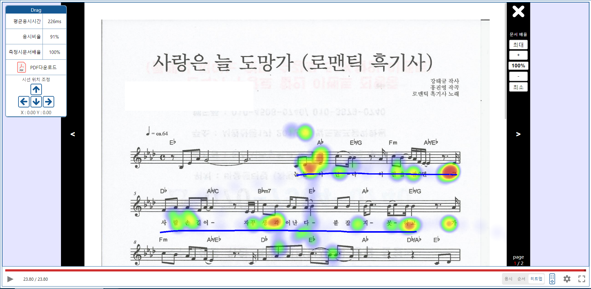

- 지금 PDF 인쇄시 리더스아이 마크 뺄것.
- 마크 외부에서 넣을시 해당 마크 사용 테스트 할것 
- 14.17.3 에서 빌드  
- 14.17.3 ,  20.11.1 에서 동작 확인완료
-----------------------------------------------------
excuted screenshot 

-------------------------------------


- how to get measuring data  
https://www.readerseye.com
- for use this  
you need readerseye data 
- how to use 
```javascript
<PDFresultModal
          onClose={() => {
            set_selPathway(null);
          }} //X 눌렀을시  click X btn
          showConfirmBtn={false} //show confirm btn
          onConfirm={() => {
            set_selPathway(null);
          }} //완료 버튼 눌렀을시  //click Confirm btn
          // path={"https://readerseye-pathway.s3.ap-northeast-2.amazonaws.com/25.pdf"} //1번 json
          // path={"https://readerseye-pathway.s3.ap-northeast-2.amazonaws.com/18.pdf"} //300번 json
          // path={"https://readerseye-pathway.s3.ap-northeast-2.amazonaws.com/95.pdf"} //301번 json

          //PDFfile URL
          path={"https://readerseye-pathway.s3.ap-northeast-2.amazonaws.com/4.pdf"} //302번 json
          viewpercent={100} //이건 측정할때의 값인데. 일단은 100 넣어버림. //pdfviewpercent

          data={{
            gazeData: data1, // readerseye data
            screenSize: {  //screensize of moment of the measurement
              width: 1920,
              height: 1080
            },
            pdfSize: { //PDFsize of moment of the measurement
              width: 1728,
              height: 2443
            }
          }}

          specialWidth={'100%'} //you can set modal width height
          specialHeight={'100%'}


          printPDFData={{
            agencyName: '테스트학원이름',
            testeeClass: 'xx반',
            testeeName: '홍길동',
            testeeID: '가나다라마바사',
            testDate: '1999.04.19',
            pdfName: '테스트PDF',
          }} // PDF download file default information
          downloadFileName="테스트파일이름" //download file name

          PDFonloadCallback={(pages) => {
            // console.log("페이지수?",pages);
          }}


          pencolor={"#0000FF"} //must HEX PDF인쇄시 HEX필요
          penweight={5} //pen weight
          penpermit={1} //show user pen writing permit
          hideRemocon={false} //default hide remocon controller
          
          isPathwayPlus={true} //heatmap rainbow permission
/>
```

